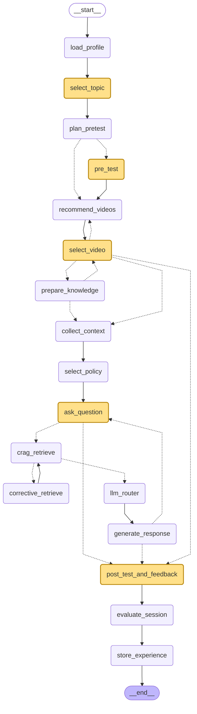

# Agent graph

Yellow = interrupt (waits for the learner). Grey = still a stub. Dashed = conditional edge.
Regenerate with `python scripts/visualize_graph.py`.

```mermaid
---
config:
  flowchart:
    curve: linear
---
graph TD;
	__start__([<p>__start__</p>]):::first
	load_profile(load_profile)
	select_topic(select_topic)
	plan_pretest(plan_pretest)
	pre_test(pre_test)
	recommend_videos(recommend_videos)
	select_video(select_video)
	prepare_knowledge(prepare_knowledge)
	collect_context(collect_context)
	select_policy(select_policy)
	ask_question(ask_question)
	crag_retrieve(crag_retrieve)
	corrective_retrieve(corrective_retrieve)
	llm_router(llm_router)
	generate_response(generate_response)
	post_test_and_feedback(post_test_and_feedback)
	evaluate_session(evaluate_session)
	store_experience(store_experience)
	__end__([<p>__end__</p>]):::last
	__start__ --> load_profile;
	ask_question -.-> crag_retrieve;
	ask_question -.-> post_test_and_feedback;
	collect_context --> select_policy;
	corrective_retrieve --> crag_retrieve;
	crag_retrieve -.-> corrective_retrieve;
	crag_retrieve -.-> llm_router;
	evaluate_session --> store_experience;
	generate_response -.-> ask_question;
	generate_response -.-> post_test_and_feedback;
	llm_router --> generate_response;
	load_profile --> select_topic;
	plan_pretest -.-> pre_test;
	plan_pretest -.-> recommend_videos;
	post_test_and_feedback --> evaluate_session;
	pre_test --> recommend_videos;
	prepare_knowledge -.-> collect_context;
	prepare_knowledge -.-> select_video;
	recommend_videos --> select_video;
	select_policy --> ask_question;
	select_topic --> plan_pretest;
	select_video -.-> collect_context;
	select_video -.-> post_test_and_feedback;
	select_video -.-> prepare_knowledge;
	select_video -.-> recommend_videos;
	store_experience --> __end__;
	classDef default fill:#f2f0ff,line-height:1.2
	classDef first fill-opacity:0
	classDef last fill:#bfb6fc
	classDef interrupt fill:#ffe08a,stroke:#b8860b,stroke-width:2px
	classDef stub fill:#e0e0e0,stroke:#757575,stroke-dasharray:4 3
	class select_topic,pre_test,select_video,ask_question,post_test_and_feedback interrupt
```
